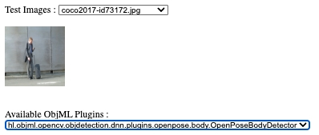

# hl-objml-serv

A demo web app that demonstrates how different types of machine learning detection models (object, segmentation, keypoint) built as [plugin JARs](https://github.com/huilam/hl-objml-plugins-samples) work together seamlessly using the [hl-objml-plugin-framework](https://github.com/huilam/hl-objml-plugin-framework).
  Currently this can only run within Eclipse-IDE project as no release package created yet.
  

**Prerequisite:**
- Download or compile **OpenCV native library** that matches the version of **opencv-xxxx.jar** found in [lib](/src/main/webapp/WEB-INF/lib/))
- Copy your **OpenCV native library** to folder [lib-native](/src/main/resources/lib-native)
- Run embeded tomcat 10\.1 wrapper [EmbededWebAppServer](/src/main/java/hl/objml/serv/EmbededWebAppServer) to start the web server
- Navigate your web browser to http://127\.0\.0\.1:8080/hl\-objml\-serv/

 

**Additional:**
- Add your custom test images @ /src/main/resources/test-images folder
- Add more hl-objml-samples jar @ /src/main/resources/plugins folder

  

**WebUI Preview**
  
 
&nbsp;&nbsp; 

